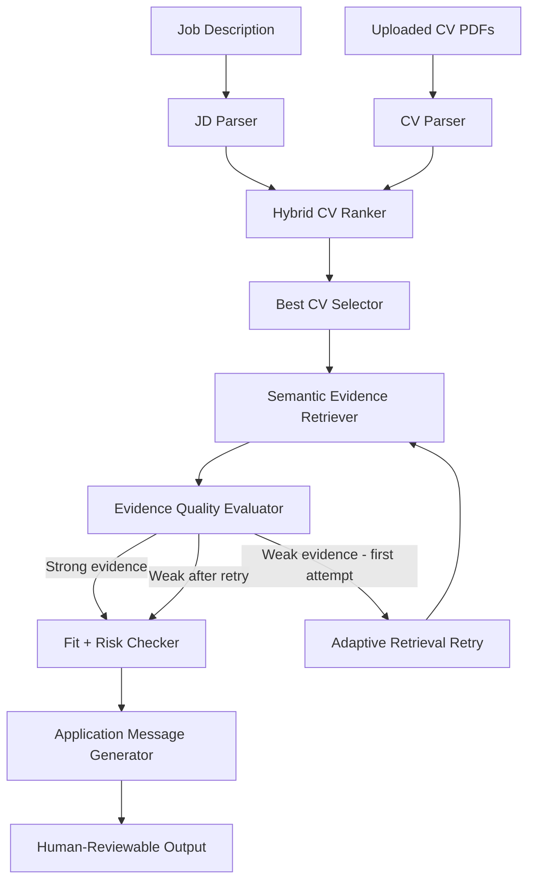
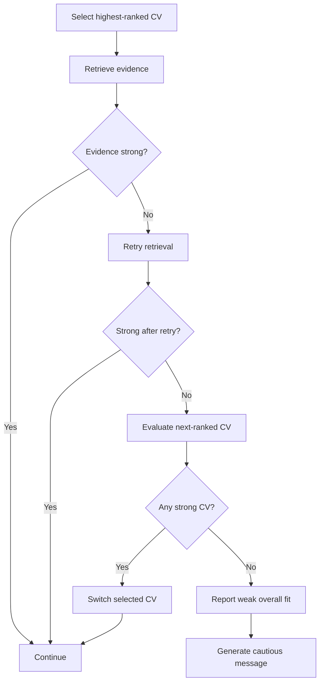

# Agentic CV–JD Matcher - Project Progress Report

## 1. Project Overview

The **Agentic CV–JD Matcher** is a Streamlit-based AI assistant that compares multiple uploaded CVs against a job description (JD), ranks the CVs, retrieves supporting evidence from the strongest candidate, identifies unsupported claims, and generates a short application message for human review.

The project has evolved from a fixed procedural matching pipeline into a **stateful LangGraph workflow with conditional decision-making and adaptive retrieval**.

Repository: `agentic-cv-jd-matcher`

---

## 2. Main Objective

The system is designed to answer four practical questions:

1. **Which uploaded CV best matches a given job description?**
2. **Why was that CV selected?**
3. **Which requirements are actually supported by evidence in the CV?**
4. **What can safely be claimed in an application message without overclaiming?**

A key design principle throughout the project has been:

> **Do not generate claims that are not supported by the selected CV.**

---

## 3. Current High-Level Architecture



The current agent therefore does more than execute a fixed pipeline. It can inspect the quality of retrieved evidence, decide whether that evidence is sufficient, and change its retrieval strategy when needed.

---

## 4. Current Project Components

| File | Responsibility |
|---|---|
| `app.py` | Streamlit user interface |
| `src/agent.py` | LangGraph workflow and agent state |
| `src/jd_parser.py` | Extracts role title, skills, domains, contract type, and languages |
| `src/cv_parser.py` | Extracts text from uploaded CV PDFs |
| `src/cv_ranker.py` | Calculates semantic, skill, domain, and hybrid CV scores |
| `src/cv_evidence_retriever.py` | Retrieves semantically relevant chunks from the selected CV |
| `src/text_matching.py` | Exact/alias-aware skill and domain matching |
| `src/__init__.py` | Package initialization |
| `requirements.txt` | Project dependencies |

The current system no longer requires a manually maintained candidate profile as its source of truth. **Uploaded CV PDFs are the candidate evidence base.**

If old `profile.json`, `cv_versions.json`, or legacy modules remain locally, they are no longer part of the intended core architecture and can be cleaned up separately.

---

## 5. CV Ranking Logic

The ranking system combines three signals rather than relying on a single matching method.

### 5.1 Semantic similarity - 55%

The project uses the Sentence Transformers model:

`sentence-transformers/all-MiniLM-L6-v2`

The JD and each CV are converted into embeddings. Cosine similarity is then used to measure how close the overall meaning of a CV is to the job description.

This allows semantically related content to match even when wording differs.

Example:

- JD: `visual defect identification`
- CV: `computer vision quality inspection`

A pure keyword matcher may miss this relationship, while embeddings can capture the semantic similarity.

### 5.2 Explicit skill overlap - 35%

The JD parser extracts recognized technical skills such as Python, PyTorch, TensorFlow, Machine Learning, Deep Learning, Computer Vision, and Anomaly Detection.

The system checks which of these skills are actually supported in each CV.

For example, if a JD contains 7 recognized skills and a CV clearly supports 6:

`Skill score = 6 / 7 × 100 ≈ 86%`

This explicit matching protects the system from relying only on broad semantic similarity.

### 5.3 Domain match - 10%

The system also detects broader domains such as Machine Learning, Deep Learning, Computer Vision, NLP, Data Engineering, Industrial AI, and Business Intelligence.

A CV focused on computer vision should rank better for a visual-inspection role than an NLP-focused CV, even if both are broadly related to AI.

### 5.4 Hybrid score

The current ranking logic is:

`Hybrid Score = 0.55 × Semantic + 0.35 × Skill + 0.10 × Domain`

This hybrid approach balances broad semantic meaning, explicit evidence, and domain-level relevance.

---

## 6. Semantic Evidence Retrieval

After the best CV is selected, the system does not treat the entire CV as one block of evidence.

Instead, it divides the CV into smaller **overlapping chunks** and embeds each chunk separately.

### Why chunk the CV?

A full CV may mix education, work experience, NLP projects, computer vision projects, tools, and unrelated skills. A smaller chunk can represent one focused section more clearly.

For each chunk:

1. Create an embedding.
2. Compare it against the JD embedding using cosine similarity.
3. Record explicit matched terms.
4. Rank the chunks.
5. Keep the strongest evidence chunks.

---

## 7. Chunking Strategy

### Initial retrieval

- `top_k = 6`
- `120 words/chunk`
- `30-word overlap`

This gives relatively large chunks with enough surrounding context.

### Adaptive retry

If the evidence is judged weak:

- `top_k = 10`
- `90 words/chunk`
- `40-word overlap`

This creates smaller, more focused chunks and searches more candidates.

### Why overlap?

Overlap reduces the chance that a meaningful phrase is split between chunk boundaries.

Example:

Without overlap:

- Chunk 1 ends with: `deep`
- Chunk 2 starts with: `learning models`

With overlap, `deep learning models` is more likely to remain together in at least one chunk.

---

## 8. Evidence Quality Evaluation

The LangGraph agent now evaluates retrieved evidence before continuing.

The evaluator considers:

- highest semantic score,
- average semantic score of the top three chunks,
- percentage of JD skills represented in the retrieved evidence.

Current heuristic:

- top semantic score >= 35
- average top-three score >= 25
- skill coverage >= 50%

If these conditions are satisfied, the evidence is considered strong.

If not, the agent can automatically retry retrieval using the broader strategy.

---

## 9. Evolution Toward Agentic Behavior

### Stage 1 - Procedural pipeline

Originally, `run_agent()` manually executed every function in sequence:

```text
parse JD
→ rank CVs
→ choose best CV
→ retrieve evidence
→ calculate fit
→ generate message
```

There was no decision-making. Every step always ran in the same order.

### Stage 2 - LangGraph stateful workflow

The procedural flow was converted into a LangGraph `StateGraph`.

The workflow now has shared state containing the JD, parsed CVs, parsed JD, ranked CVs, selected CV, evidence, evidence quality, retry count, fit score, risk notes, and generated message.

Each graph node reads from state and returns state updates.

### Stage 3 - Conditional routing

A conditional route was added after CV selection:

- if no CV is available → stop,
- otherwise → continue to evidence retrieval.

This introduced explicit graph-level branching.

### Stage 4 - Evidence-quality decision

A new node evaluates whether retrieved evidence is sufficiently strong.

The agent now observes the output of one tool before deciding what to do next.

### Stage 5 - Adaptive retry loop

If the first evidence retrieval is weak, the graph automatically changes strategy:

```text
retrieve
→ evaluate
→ weak?
→ change chunk size / overlap / top_k
→ retrieve again
→ evaluate again
```

This is the project's first true **decision + adaptation + retry loop**.

---

## 10. What Makes the Current System Agentic?

The system is not yet a fully autonomous LLM agent, but it has progressed beyond a fixed script.

It now has several important agentic properties:

- **State** - LangGraph maintains shared state across the workflow.
- **Observation** - the agent examines retrieval quality after a tool produces output.
- **Decision** - the graph chooses between continuing, stopping, or retrying.
- **Strategy adaptation** - retry changes retrieval parameters instead of repeating the same call.
- **Guardrails** - unsupported JD skills are not treated as candidate experience.
- **Traceability** - the Streamlit interface exposes an agent workflow trace.

---

## 11. Overclaim Risk Checking

A major safety feature is the overclaim checker.

For every skill extracted from the JD, the system determines whether the selected CV clearly supports it.

If a required skill is absent, the system produces a warning such as:

> `'anomaly detection' was found in the job description but not clearly found in the selected CV. Do not claim it directly.`

This prevents the application generator from inventing experience that the candidate has not documented.

---

## 12. Important Logic and Parsing Improvements

Several bugs and weaknesses were discovered through testing and fixed.

### 12.1 Germany incorrectly detected as German

Previous language detection used substring matching.

Therefore:

`"german" in "germany" → True`

This caused `Location: Lingen, Germany` to incorrectly produce `Languages: English, German`.

The parser was changed to use regex word boundaries.

Result:

- `German` → matches
- `Germany` → does not match

The ROSEN JD now correctly returns only `Languages: English`.

### 12.2 Role title extraction improvement

The ROSEN title was initially extracted together with the beginning of the next sentence.

The title extractor was updated to stop when common description phrases begin, such as `We are looking`, `We are seeking`, `Your role`, `Your mission`, and `About the role`.

The role title is now cleanly extracted.

### 12.3 Git falsely detected inside GitHub

The earlier text matcher used substring matching:

```python
candidate in normalized_text
```

This allowed `git` to match inside `github`.

The matcher was rewritten using whole-word / whole-phrase regex boundaries.

Now:

- `Git` → matches
- `experience with Git` → matches
- `GitHub` → does **not** imply Git

This is especially important because the system is explicitly designed to avoid overclaiming.

### 12.4 More conservative aliases

The previous matcher treated `Spark` as sufficient evidence for `PySpark`.

This was tightened:

- `PySpark` / `Py Spark` → supports PySpark
- generic `Spark` alone → does not automatically prove PySpark

Again, the design favors conservative evidence over inflated matching.

---

## 13. Validation Test 1 - ROSEN AI / Computer Vision Thesis

### Test JD

**Master thesis: AI for Anomaly Detection in Non-Destructive Testing**

Important requirements included anomaly detection, computer vision, deep learning, machine learning, Python, PyTorch, and TensorFlow.

### Ranking result

| CV | Hybrid | Semantic | Skill | Domain |
|---|---:|---:|---:|---:|
| `CV_latest.pdf` | **65** | 52 | **86** | 60 |
| `CV_Data_AI_ML.pdf` | 61 | **59** | 57 | **80** |
| `CV_NLP.pdf` | 53 | 49 | 57 | 60 |

Selected: `CV_latest.pdf`

### Evidence result

- Top semantic evidence score: **50**
- Evidence skill coverage: **86%**
- Retry count: **0**

The agent correctly decided that the initial evidence retrieval was strong enough and did not waste time retrying.

### Risk result

Missing / unsupported: `anomaly detection`

The system correctly warned against claiming direct anomaly-detection experience.

---

## 14. Validation Test 2 - Deliberately Poor-Match JD

A deliberately mismatched JD was created to test the retry branch.

### Test role

**Internship: Industrial Monitoring Dashboard Developer**

Key extracted skills:

- anomaly detection
- Git
- Streamlit

After fixing the Git/GitHub false positive, none of the uploaded CVs clearly supported these three requirements.

### Ranking result

| CV | Hybrid | Semantic | Skill | Domain |
|---|---:|---:|---:|---:|
| `CV_Data_AI_ML.pdf` | **26** | **48** | 0 | 0 |
| `CV_latest.pdf` | 22 | 40 | 0 | 0 |
| `CV_NLP.pdf` | 18 | 32 | 0 | 0 |

Selected: `CV_Data_AI_ML.pdf`

### Evidence result

- Top semantic score after retry: **55**
- Skill coverage: **0%**
- Retry count: **1**
- Evidence retrieval retry: **triggered**

This successfully proved that the LangGraph retry branch works.

The higher semantic score did **not** override the absence of explicit skill evidence.

That is an important property of the hybrid architecture.

---

## 15. What the Poor-Match Test Demonstrated

The poor-match test validated multiple pieces of logic at once:

1. Semantic similarity alone is not treated as proof of a skill.
2. Unsupported skills remain missing even when the overall text is semantically related.
3. Weak evidence causes an adaptive retrieval retry.
4. The retry loop terminates instead of repeating indefinitely.
5. The overclaim checker remains conservative.
6. The Git/GitHub substring bug is fixed.

---

## 16. Current Workflow Trace

The Streamlit interface exposes a trace similar to:

```text
1. JD Parser
2. Hybrid CV Ranker
3. Best CV Selector
4. Semantic Evidence Retriever
5. Evidence Quality Evaluator
6. Evidence Retrieval Retry   <- only when required
7. Fit + Risk Checker
8. Message Generator
```

This makes the agent's behavior inspectable rather than opaque.

For a strong match such as ROSEN, the retry step is skipped.

For a weak match, the retry node appears in the trace.

---

## 17. Current Strengths

The system now provides:

- Multi-CV PDF ingestion
- Structured JD parsing
- Sentence-transformer semantic matching
- Explicit skill matching
- Domain matching
- Hybrid CV ranking
- Automatic best-CV selection
- Chunk-level semantic evidence retrieval
- Evidence-strength evaluation
- Adaptive retrieval retry
- Skill gap analysis
- Conservative overclaim checking
- Human-reviewable application-message generation
- LangGraph state management
- Conditional graph routing
- Visible workflow trace

---

## 18. Current Limitations

### Static keyword dictionaries

Skill and domain recognition relies partly on manually defined keyword lists and aliases. Unknown technologies may not be extracted automatically.

### Heuristic thresholds

Evidence-quality thresholds are currently engineering heuristics rather than learned/calibrated thresholds.

### One retry strategy

The current agent performs at most one retrieval retry. This prevents infinite loops but limits adaptive search.

### It does not yet reconsider the selected CV

If the highest-ranked CV is selected, initial retrieval is weak, and retry retrieval is still weak, the current system still continues with that CV.

The planned next improvement is to let the agent test the **next-ranked CV**.

### Message generation is still template-based

The application message is deterministic and conservative. It is evidence-aware, but not yet an LLM-generated, deeply tailored cover letter.

### Not yet a fully autonomous LLM agent

The project now has agentic workflow behavior, but it does not yet use an LLM for autonomous planning/tool selection. That distinction is intentional.

---

## 19. Planned Next Agentic Upgrade

The next major step is **CV reconsideration**.

Planned logic:



This would allow the agent to challenge its original ranking decision using downstream evidence.

That is a stronger form of agentic reasoning than merely changing retrieval parameters.

---

## 20. Additional Planned Improvements

Possible later upgrades include:

- dynamic skill extraction instead of only static dictionaries,
- LLM-based JD parsing,
- LLM-assisted evidence interpretation,
- evidence-grounded application letter generation,
- better calibrated match thresholds,
- CV reconsideration and multi-CV evidence comparison,
- human-in-the-loop approval nodes,
- persistence/checkpointing with LangGraph,
- richer explanation of why one CV outranks another,
- exportable reports,
- automated testing/regression fixtures,
- visual graph rendering,
- optional integration with job-search/application workflows.

---

## 21. Development Philosophy

The project has deliberately prioritized **correctness, transparency, and defensibility** over flashy automation.

The progression has been:

```text
keyword matching
→ semantic CV ranking
→ hybrid scoring
→ evidence retrieval
→ evidence grounding
→ overclaim protection
→ LangGraph state
→ conditional routing
→ evidence evaluation
→ adaptive retry
→ planned CV reconsideration
```

The key idea is not merely to label the system "agentic."

The goal is to progressively introduce **observable decisions, explicit state, tool outputs, branching, adaptation, and guardrails** so that each increase in agentic behavior has a concrete functional purpose.

---

## 22. Current Status

At the current pause point, the project has successfully demonstrated:

- stable hybrid CV ranking,
- correct semantic evidence retrieval,
- conservative skill matching,
- overclaim protection,
- LangGraph orchestration,
- evidence-quality decision-making,
- an adaptive retry loop,
- correct behavior on both a strong-match and deliberately weak-match test case.

The project is therefore at a useful intermediate milestone:

> **A transparent, evidence-grounded CV–JD matching workflow with early agentic decision-making, ready for CV reconsideration and richer reasoning in the next development phase.**
